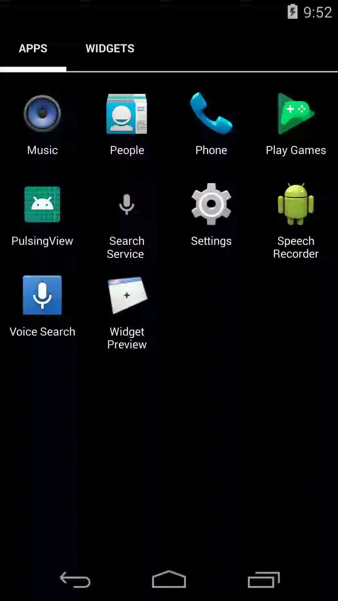
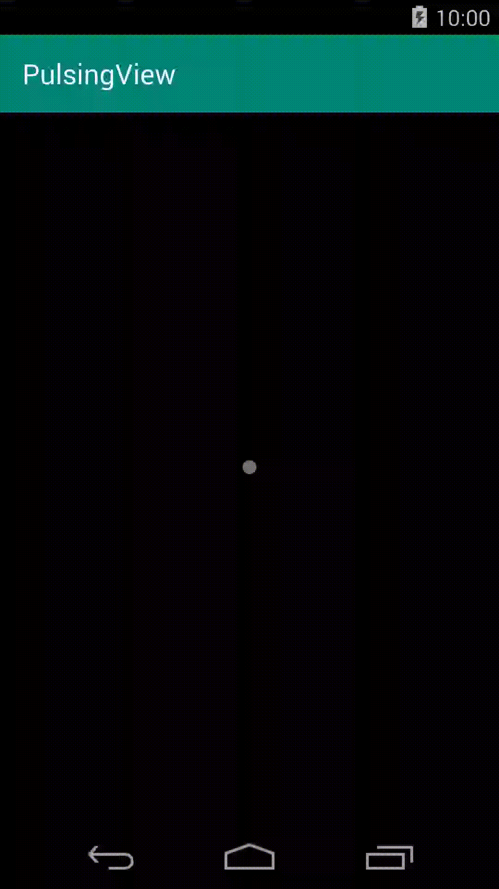

# PulsingView
An Android Library

# What it can be used for?

Includes two views:
-PulsingView
-PulsingLayout

PulsingView can be used for indeterminate progresses.

PulsingLayout is based on RelativeLayout and includes pulsing view.
PulsingLayout can be used for animated relative layout.

# Implementation

Firstly, add JitPack repo

allprojects {
		repositories {
			...
			maven { url 'https://jitpack.io' }
		}
	}
  
Add build.gradle dependency

	dependencies {
	        implementation 'com.github.metahex:PulsingView:master-SNAPSHOT'
	}

# Preview

# PulsingLayout

# PulsingView

